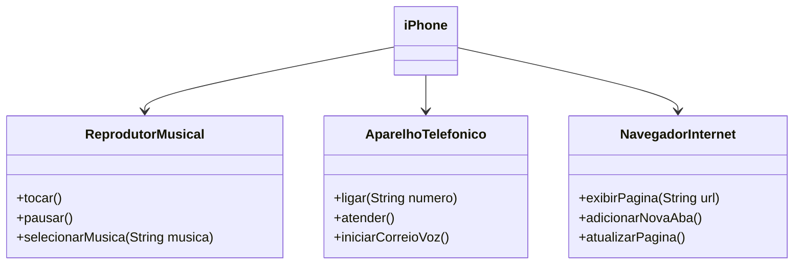

# DESAFIO POO

Projeto destinado ao aprendizado do uso de interfaces na linguagem Java e também como modelar as funcionalidades de um produto usando UML.

### Contexto
Com base no vídeo de lançamento do iPhone de 2007 (link abaixo), foram elaboradas a diagramação das classes e a das interfaces utilizando uma ferramenta UML.

[Lançamento iPhone 2007](https://www.youtube.com/watch?v=9ou608QQRq8)
- Minutos relevantes: 00:15 até 00:55

#### Funcionalidades que foram modeladas
1. **Reprodutor Musical**
   - Métodos: `tocar()`, `pausar()`, `selecionarMusica(String musica)`
2. **Aparelho Telefônico**
   - Métodos: `ligar(String numero)`, `atender()`, `iniciarCorreioVoz()`
3. **Navegador na Internet**
   - Métodos: `exibirPagina(String url)`, `adicionarNovaAba()`, `atualizarPagina()`

## Diagrama UML
